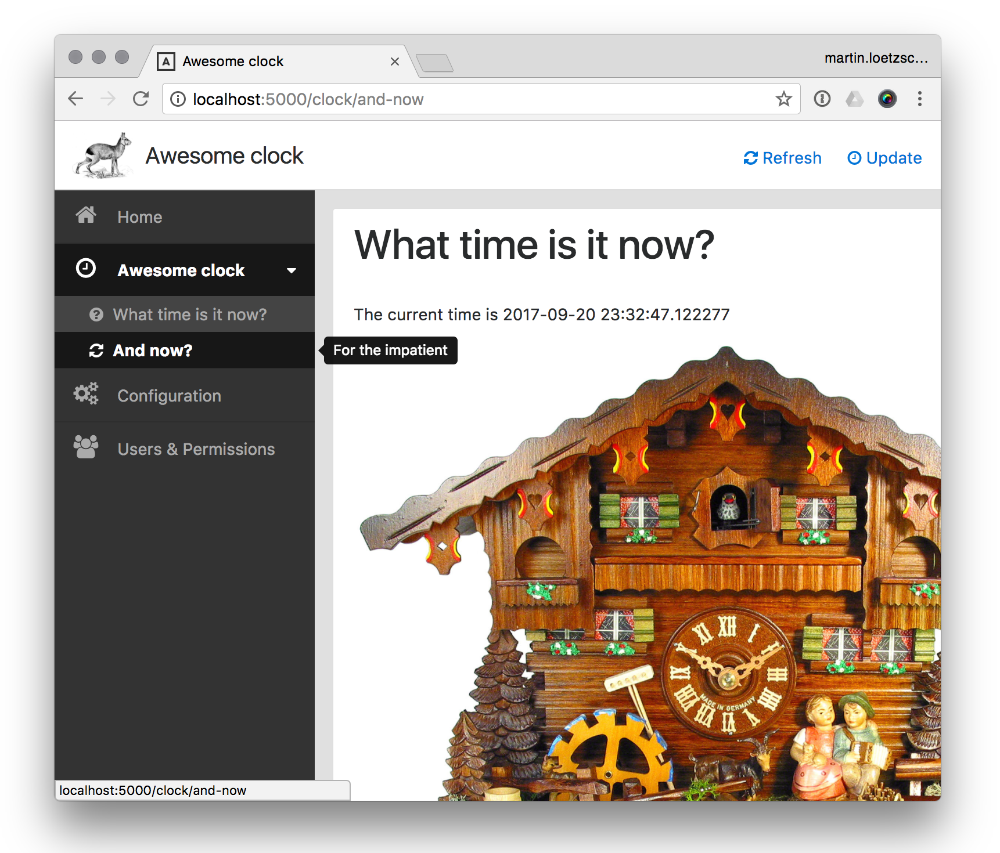

Example
=======

This is a simple web ui for displaying the current time:
 
```python
"""Clock UI"""

import flask
from awesome_clock import clock
from mara_page import acl, navigation, response, bootstrap, _

# The flask blueprint that handles
blueprint = flask.Blueprint('awesome_clock', __name__, url_prefix='/clock', static_folder='static')

# Defines an ACL resource (needs to be handled by the application)
acl_resource = acl.AclResource('Clock')


def navigation_entry():
    """Defines a part of the navigation tree (needs to be handled by the application)"""
    return navigation.NavigationEntry(
        label='Awesome clock', icon='clock-o', description='Something that tells the time',
        children=[
            navigation.NavigationEntry(
                label='What time is it now?',
                uri_fn=lambda: flask.url_for('awesome_clock.clock_page', when='now'),
                icon='question-circle', description='Should be able to display the current time'),

            navigation.NavigationEntry(
                label='And now?', icon='refresh', description='For the impatient',
                uri_fn=lambda: flask.url_for('awesome_clock.clock_page', when='and-now'))
        ])


@blueprint.route('/<string:when>')
@acl.require_permission(acl_resource)  # Requires permission to the `'Clock'` resource
def clock_page(when: str):
    """Defines the `/clock` page"""
    return response.Response(
        # The actual page content (can be also a call to `flask.render_template`
        # or anything else that produces a string)
        html=bootstrap.card(header_left=_.h1['What time is it now?'],
                            body=[_.p['The current time is ', str(clock.what_time_is_it_now())],
                                  _.img(src=flask.url_for('awesome_clock.static', filename='cuckoo-clock.jpg'),
                                        style='max-width:100%')]),
        # The page title
        title='Awesome clock',

        # Action buttons
        action_buttons=[
            response.ActionButton('javascript:location.reload()', 'Refresh', 'Refresh clock', 'refresh'),
            response.ActionButton('javascript:location.reload()', 'Update', 'Refresh clock', 'clock-o')
        ]
    )
```

It is up to the actual Flask app to define how to render such a response and what to do with the ACL resources and navigation entries. 
The [mara app](https://github.com/mara/mara-app) will render the response like this:


